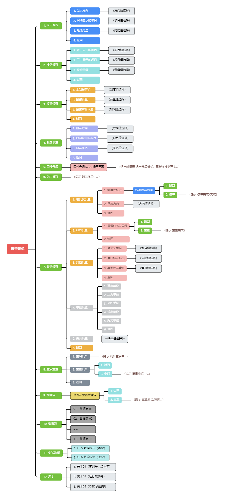

# 设置

## 设置菜单全览 

<figure><figcaption>
设置菜单全览
</figcaption></figure>

## 固件升级 (OTA) 

进入「设置菜单」 → 「固件升级(OTA) 」界面后，将自动关闭 ADU 设备的蓝牙并开启 WiFi，ADU 设备作为 AP（接入点）用于接收 OTA 固件。

### 连接参数 

* SSID 名称：`ADU-WiFi`
* SSID 密码：`12345678`
* IP 地址：`192.168.99.1`

### 升级方法 

1. 将已编译的固件 (.bin 文件) 下载到手机等终端
2. 进入 ADU 的「设置菜单」 → 「固件升级(OTA) 」界面
3. 手机等终端连接 `ADU-WiFi` 网络后，浏览器打开 `192.168.99.1`，根据页面提示上传固件 (.bin 文件)
4. 等待约 30 秒，ADU 设备自动重启后，即完成固件升级


若长时间后 ADU 未自动重启，代表升级失败。需手动重启 ADU（关闭再打开 ADU 电源），然后重新进入 「固件升级(OTA) 」 界面再次尝试升级。


## 重置设备 

设备重置后将恢复为默认值。需根据需要修改参数（特别是**选择蓝牙头型号**、以及**修改陀螺仪摆放反向**和**校准陀螺仪**）。
