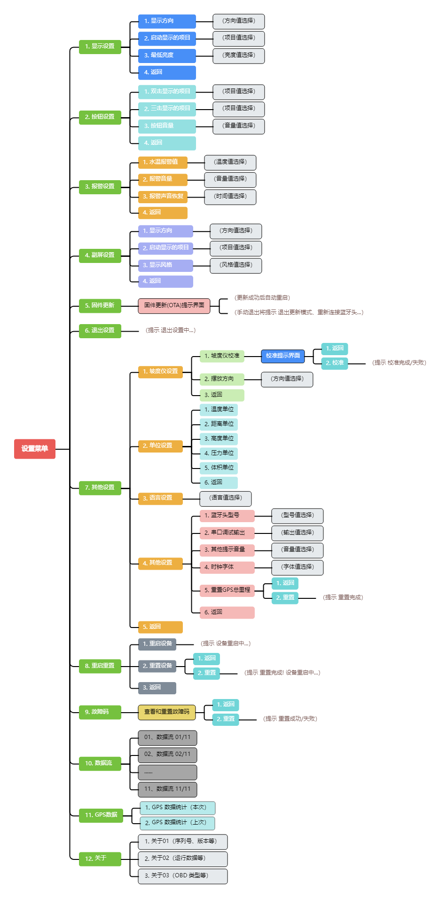

# 設定

## 設定選單全覽 

<figure><figcaption>
設定選單
</figcaption></figure>

## 韌體更新 (OTA) 

進入「設定選單」→韌體更新 (OTA)」界面后，將自動關閉 ADU 裝置的藍牙並開啓 WiFi，ADU 裝置將作爲 AP（接入點）用於接收 OTA 韌體。

### 連接參數 

* SSID 名稱：`ADU-WiFi`
* SSID 密碼：`12345678`
* IP 位址：`192.168.99.1`

### 更新步驟 

1. 將已編譯的韌體 (.bin 檔案) 下載到手機等裝置。
2. 進入 ADU 的「設定選單」→「韌體更新 (OTA)」界面。
3. 手機等裝置連接 `ADU-WiFi` 網路后，瀏覽器打開 `192.168.99.1`，根據頁面提示上傳韌體 (.bin 檔案)。
4. 等待約 30 秒，ADU 裝置自動重啓后，即完成韌體更新。


若 ADU 長時間未自動重啓，代表更新失敗。需手動重啓 ADU（使用自帶電源開關或汽車重新點火），然後重新進入「韌體更新 (OTA)」界面再次嘗試更新。

放心！更新失敗并不會導致 ADU 無法使用！


## 重置裝置 

裝置重置后將恢復初始值。需根據需要修改設定參數（特別是**選擇藍牙適配器型號**、以及**修改陀螺儀擺放方位**和**校準陀螺儀**）。
